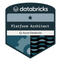
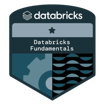

<h3 id="top" align="center"><strong>Hi — I'm Robin!</strong></h3>

---

 
    • <a href="#about-me">About Me</a> 
    • <a href="#current-focus">Current Focus</a> 
    • <a href="#what-i-use">What I Use</a> 
    • <a href="#accreditations">Accreditations</a> 
    • <a href="#contact-me">Contact Me</a> • 

---

<h2 id="about-me">💡 About Me</h2>

I'm a data engineer and analyst who bridges conservation science and technology. With a PhD in molecular biology and field experience in African ecosystems, I've built a career on continuous learning — moving from benchwork to fieldwork to engineering data systems that turn data into action.

I work across the full data lifecycle: ETL pipelines, cloud infrastructure, data warehousing, BI dashboards, and web applications. My knowledge of statistics, advanced modelling, and data visualisation complements my engineering skills, enabling me to translate complex systems and user needs into practical solutions for both scientific and business/operations data.

I enjoy designing data products and visualisations with the end user in mind — transforming data into actionable insights by focusing on what they need to see and ensuring trustworthiness. I'm eager to contribute across the stack: building and maintaining data pipelines, shipping data products, developing applications, and creating visualisations that drive decisions.

  

<h2 id="current-focus">🔭 Current Focus</h2>

> Databricks Data Engineer Associate certification

  

<h2 id="what-i-use">⚡ What I Use</h2>

#### Languages & Scripting

#### Markup & Styling

#### Cloud & Infrastructure

#### Dev & CI

#### Data & Analytics

#### Spatial Data Extensions

#### Sites & Hosting

#### Design & Diagrams

  

<h2 id="accreditations">💫 Accreditations & Certifications</h2>

 

  

<h2 id="contact-me">📨 Contact Me</h2>

  

