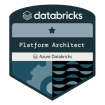
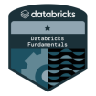

<h3 id="top" align="center"><strong>Hi — I'm Robin!</strong></h3>

---

 
    • <a href="#about-me">About Me</a> 
    • <a href="#current-focus">Current Focus</a> 
    • <a href="#what-i-use">What I Use</a> 
    • <a href="#accreditations">Accreditations</a> 
    • <a href="#contact-me">Contact Me</a> • 

---

<h2 id="about-me">💡 About Me</h2>

I'm a data engineer and analyst working at the intersection of conservation science and technology. A PhD in molecular biology and field research in African ecosystems took me from the lab bench to remote fieldwork to building the systems that turn observations into decisions.

I work across the full data lifecycle — ETL pipelines, cloud infrastructure, warehousing, dashboards, and web applications — grounded in statistics, modelling, and visualisation. That blend lets me translate messy systems and real user needs into products people can act on and trust, whether the questions are scientific or operational.

What I enjoy most is designing for the person on the other end: surfacing exactly what they need to see, and earning their trust in it. I'm keen to contribute across the stack, from the pipelines underneath to the products on top.

  

<h2 id="current-focus">🔭 Current Focus</h2>

➤ Building full-stack data products for conservation-focused clients.  
➤ Developing and testing ML classifiers for cryptic species.  
➤ Exploring SedonaDB for fast, embedded geospatial analytics.  

  

<h2 id="what-i-use">⚡ What I Like Using</h2>

#### Languages & Scripting

#### Web & Frameworks

#### Cloud & Infrastructure

#### Dev

#### Data & Analytics

[![dbt Badge][dbt-badge]](#)

#### Visualisation

[![Recharts Badge][recharts-badge]](#)

#### Spatial Data Extensions

#### Sites & Hosting

#### Design & Diagrams

[![LikeC4 Badge][likec4-badge]](#)

  

<h2 id="accreditations">💫 Accreditations & Certifications</h2>

 

  

<h2 id="contact-me">📨 Contact Me</h2>

  

<!-- Badge logo reference definitions -->
[dbt-badge]: https://img.shields.io/badge/dbt-FF694B?logo=data:image/svg%2bxml;base64,PHN2ZyBmaWxsPSJ3aGl0ZSIgcm9sZT0iaW1nIiB2aWV3Qm94PSIwIDAgMjQgMjQiIHhtbG5zPSJodHRwOi8vd3d3LnczLm9yZy8yMDAwL3N2ZyI%2BPHRpdGxlPmRidDwvdGl0bGU%2BPHBhdGggZD0iTTE3LjkwMDQgOS4zNzYzYTguMTQ4OCA4LjE0ODggMCAwIDAtMy4wNDIxLTMuMTIwNmwxLjc3MDguODM4NWExMC4yODc0IDEwLjI4NzQgMCAwIDEgMy43NCAzLjAwMDdsMy4yMzQtNS45Mjk1YTIuODU0NiAyLjg1NDYgMCAwIDAtLjA2MTEtMi45NjA0QzIyLjc1NjYuMDM3MSAyMS4yMTEyLS4zNDA5IDE5Ljk3NTQuMzMyN2wtNS44NzQ5IDMuMjEwMWE0LjM2MTIgNC4zNjEyIDAgMCAxLTQuMTc2MSAwTDQuMTc2OS40MDhhMi44NTQ1IDIuODU0NSAwIDAgMC0yLjk1OTIuMDYzMmMtMS4xNjczLjc4NTMtMS41NDUyIDIuMzMtLjg3MjMgMy41NjU1TDMuNTUgOS45MTA2YTQuMzYxMiA0LjM2MTIgMCAwIDEgMCA0LjE3NzJsLTMuMTI3MiA1Ljc0M2EyLjg2IDIuODYgMCAwIDAgLjA4NSAyLjk5NzRjLjc5NCAxLjE0MzggMi4zMjI1IDEuNTA1NCAzLjU0NDguODM4NWw2LjA1ODEtMy4zMDQ5YTEwLjI4NzcgMTAuMjg3NyAwIDAgMS0zLjAwNTEtMy43NDU0bC0uODM3NC0xLjc3MDhhOC4xNDggOC4xNDggMCAwIDAgMy4xMjA2IDMuMDQyMWwxMC41ODMyIDUuNzc5YzEuMjIxMy42NjYgMi43NDgxLjMwNTUgMy41NDI2LS44MzYzYTIuODY5OSAyLjg2OTkgMCAwIDAgLjA3OTYtMy4wMDE4TDE3LjkwMDQgOS4zNzYzem0zLjM4MDEtNy43MzUxYy42MDIyIDAgMS4wOTA0LjQ4ODIgMS4wOTA0IDEuMDkwNHMtLjQ4ODIgMS4wOTA0LTEuMDkwNCAxLjA5MDQtMS4wOTA0LS40ODgyLTEuMDkwNC0xLjA5MDQuNDg4Mi0xLjA5MDQgMS4wOTA0LTEuMDkwNHpNMi43NDQyIDMuODIyYy0uNjAyMiAwLTEuMDkwNC0uNDg4Mi0xLjA5MDQtMS4wOTA0cy40ODgyLTEuMDkwNCAxLjA5MDQtMS4wOTA0IDEuMDkwNC40ODgyIDEuMDkwNCAxLjA5MDRTMy4zNDY0IDMuODIyIDIuNzQ0MiAzLjgyMnptMCAxOC41MzYzYy0uNjAyMiAwLTEuMDkwNC0uNDg4Mi0xLjA5MDQtMS4wOTA0IDAtLjYwMjIuNDg4Mi0xLjA5MDQgMS4wOTA0LTEuMDkwNHMxLjA5MDQuNDg4MiAxLjA5MDQgMS4wOTA0YzAgLjYwMjItLjQ4ODIgMS4wOTA0LTEuMDkwNCAxLjA5MDR6bTEwLjM1ODUtMTEuNDQ4OWMtMS4yMDA4LS4wMDM1LTIuMTc3Ljk2NzItMi4xODA1IDIuMTY3OWEyLjE3MzggMi4xNzM4IDAgMCAwIC43MDUyIDEuNjA5MWMtMS40ODcyLS4yMDkxLTIuNTIzNC0xLjU4NDMtMi4zMTQyLTMuMDcxNi4yMDkxLTEuNDg3MiAxLjU4NDMtMi41MjM0IDMuMDcxNi0yLjMxNDJhMi43MTk0IDIuNzE5NCAwIDAgMSAyLjMxNDIgMi4zMTQyIDIuMTYyMyAyLjE2MjMgMCAwIDAtMS41OTYzLS43MDU0em04LjE3NzggMTEuNDQ4OWMtLjYwMjIgMC0xLjA5MDQtLjQ4ODItMS4wOTA0LTEuMDkwNCAwLS42MDIyLjQ4ODItMS4wOTA0IDEuMDkwNC0xLjA5MDRzMS4wOTA0LjQ4ODIgMS4wOTA0IDEuMDkwNGMwIC42MDIyLS40ODgyIDEuMDkwNC0xLjA5MDQgMS4wOTA0eiIvPjwvc3ZnPg%3D%3D&logoColor=fff
[recharts-badge]: https://img.shields.io/badge/Recharts-22B5BF?logo=&logoColor=fff
[likec4-badge]: https://img.shields.io/badge/LikeC4-5E98AF?logo=&logoColor=fff
